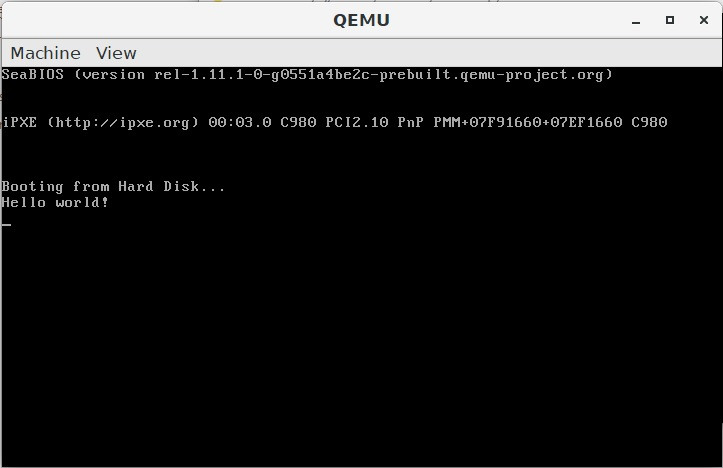

# 输出字符串

在模拟器中编程，模拟的是裸机环境。当计算机启动时，BIOS 中的程序读取启动介质的第一个扇区，将这 512 字节的内容加载到内存地址 0x7c00-0x7dff 处，`cs:ip` 指向 0x7c00，程序便开始运行。第一个扇区的最后两个字节规定为 0x55 和 0xaa，这是可启动扇区的标志，如果标志不是 0x55 和 0xaa，则 BIOS 会输出错误 No bootable device。

实验内容：

在屏幕上输出 Hello world。



思路：

为了输出字符，需要调用 BIOS 的 0x10 号中断，al 寄存器中存放字符的 ASCII 码，ah 寄存器中存放 0x0e。循环遍历字符串，输出每个字符。

```text
[org    0x7c00]      ; 说明这个程序将会被装载到地址 0x7c00 处

start:
    mov    si,str_hello      ; 将字符串的偏移地址送入 si
    call    prints            ; 调用输出字符串函数

fin:
    hlt                ; 使处理器处于低功耗状态
    jmp    fin        ; 无限循环，即什么都不做

; Print a null-terminated string on the screen.
; ds:si The first character of the string.
prints:
    push    ax                       ; 保护寄存器 ax
    mov    al,[si]                  ; 取第一个字符
    or    al,al                    ; 根据字符自身设置标志位
    je    .prints.fin              ; 若字符为 0 则结束

    .prints.loop:
        mov    ah,0x0e          ; 输出一个字符
        int    0x10             ; 调用 BIOS 中断
        inc    si               ; si 指向下一个字符
        mov    al,[si]          ; 取字符
        or    al,al            ; 根据字符自身设置标志位
        jne    .prints.loop     ; 若字符不为 0 则继续循环

    .prints.fin:
        pop    ax
        ret

str_hello:
    db    `Hello world!\r\n`,0

signature:
    %if    $-$$>510           ; 启动区最长不能超过扇区的大小 512 字节
        %fatal    "stage1 code exceed 512 bytes."
    %endif

    times    510-($-$$) \
        db    0     ; $ 是当前行地址，$$ 是段基址，($-$$) 表示当前已使用的字节数，填充 0 直到填满 510 字节
    db    0x55,0xaa     ; 最后 2 字节可启动标志
```

#### 

