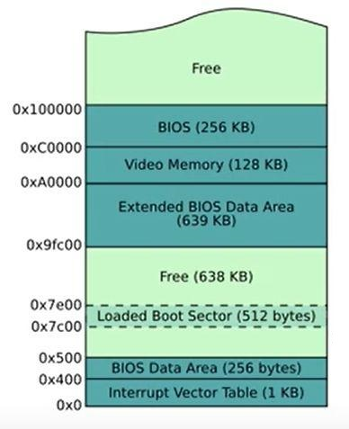

# 输出 BCD 码

实验内容：

在内存一个字节的单元中存放两位 BCD 码（8421 码），通过编程实现将这两位 BCD 码转为 ASCII 码输出。

思路：

数字的 BCD 码与 ASCII 码的对应关系如下：

| 数字 | 0 | 1 | 2 | 3 | 4 | 5 | 6 | 7 | 8 | 9 |
| :--- | :---: | :---: | :---: | :---: | :---: | :---: | :---: | :---: | :---: | :---: |
| BCD 码（十六进制） | 0 | 1 | 2 | 3 | 4 | 5 | 6 | 7 | 8 | 9 |
| ASCII 码（十六进制） | 30 | 31 | 32 | 33 | 34 | 35 | 36 | 37 | 38 | 39 |

通过观察发现，只需将 BCD 码的值与 0x30 做或运算，即可转换为 ASCII 码。

```text
[org    0x7c00]

start:
    xor    bh,bh          ; 将 bh 清空
    mov    bl,[bcd_num]   ; 取出内存中的 BCD 码送入 bl
    shl    bx,4           ; bx 中的 BCD 码左移 4 位，高位数字移入 bh 的低位，低位数字移入 bl 的高位
    shr    bl,4           ; bl 中的 BCD 码右移 4 位，低位数字移入 bl 的低位
    or    bx,0x3030      ; bh 和 bl 同时与 0x30 做或运算

    mov    al,bh         ; 输出高位
    mov    ah,0x0e       ; 输出一个字符
    int    0x10          ; 调用 BIOS 中断

    mov    al,bl         ; 输出低位
    mov    ah,0x0e       ; 输出一个字符
    int    0x10          ; 调用 BIOS 中断

fin:
    hlt
    jmp    fin

bcd_num:
    db    0x42     ; 存放 BCD 码 42

signature:
    %if    $-$$>510
        %fatal    "stage1 code exceed 512 bytes."
    %endif

    times    510-($-$$) \
        db    0
    db    0x55,0xaa
```

#### 读盘

BIOS 只会将启动介质第一个扇区的内容读入内存 0x7c00-0x7bff 处，如果程序大于一个扇区，后面的内容就要通过 BIOS 中断读入内存。

实验内容：

实验内容同上，但两位 BCD 码存放在第二扇区。

思路：

BIOS 中断 INT 13H，AH=02H 从驱动器中读扇区。

参数

* AH 02h
* AL Sectors To Read Count
* CH Cylinder
* CL Sector
* DH Head
* DL Drive
* ES:BX Buffer Address Pointer

结果

* CF Set On Error, Clear If No Error
* AH Return Code
* AL Actual Sectors Read Count

DL 中存放的是设备号。由于运行 QEMU 时，命令行参数中指定了 media=disk，是硬盘，编号从 0x80 开始，第一块硬盘的设备号为 0x80。若是软盘，则从 0 开始。



根据内存分布图可知，0x7e00-0x7fff 这 512 字节的内容是空闲的，可以存放第二扇区。

```text
SECTION mbr vstart=0x7c00       ; 第一个扇区，第一段

start:
    mov    ah,0x02        ; 读盘
    mov    al,0x01        ; 读 1 个扇区
    mov    ch,0     ; 0 柱面
    mov    cl,2     ; 2 扇区
    mov    dh,0     ; 0 磁头
    mov    dl,0x80        ; 设备号 0x80
    mov    bx,0x07e0      ; es:bx 指向 0x7e00
    mov    es,bx
    mov    bx,0
    int    0x13           ; 调用 BIOS 中断
    jc    fin            ; 如果出错直接结束

    xor    bh,bh
    mov    bl,[bcd_num]
    shl    bx,4
    shr    bl,4
    or    bx,0x3030

    mov    al,bh
    mov    ah,0x0e
    int    0x10

    mov    al,bl
    mov    ah,0x0e
    int    0x10

fin:
    hlt
    jmp    fin

signature:
    times    510-($-$$) \
        db    0
    db    0x55,0xaa

SECTION second_sector vstart=0x7e00       ; 第二个扇区，第二段

bcd_num:
    db    0x42     ; 存放 BCD 码 42

fill:
    times    512-($-$$) \
        db    0        ; 填充第二个扇区，$-$$ 表示当前段已使用的字节数
```

参考资料：

* [https://en.wikipedia.org/wiki/INT\_13H](https://en.wikipedia.org/wiki/INT_13H)

Bochs 调试方法

### 附录

```text
[org    0x7c00]

start:

    ; Add scripts here

fin:
    hlt
    jmp    fin

signature:
    %if    $-$$>510
        %fatal    "stage1 code exceed 512 bytes."
    %endif

    times    510-($-$$) \
        db    0
    db    0x55,0xaa
```

Makefile

```text
main.bin : main.asm Makefile
    nasm -fbin main.asm -o main.bin -l main.lst

run : main.bin
    qemu-system-x86_64 -soundhw all -rtc base=localtime -drive file=main.bin,format=raw,index=0,media=disk

dmp : main.bin
    objdump -M intel -b binary -m i8086 -D main.bin
```

#### 基本函数实现

**扬声器发声**

beep

```text
; Make a beep sound
beep:
    pusha

    mov    al,0xb6
    out    0x43,al          ; 8254 CNT2
    mov    ax,0x0533        ; Sound frequency 896 Hz
    out    0x42,al
    mov    al,ah
    out    0x42,al

    in    al,0x61          ; 8255 PB
    mov    ah,al
    or    al,0x03          ; Enable 8254 CNT2
    out    0x61,al

    mov    cx,0x0055        ; Last for some time
    loop2:
        push    cx
        mov    cx,0xffff
        loop1:
            nop
            loop    loop1
        pop    cx
        loop    loop2

    mov    al,ah
    out    0x61,al          ; Restore 8255 PB
    popa
    ret
```

#### 

