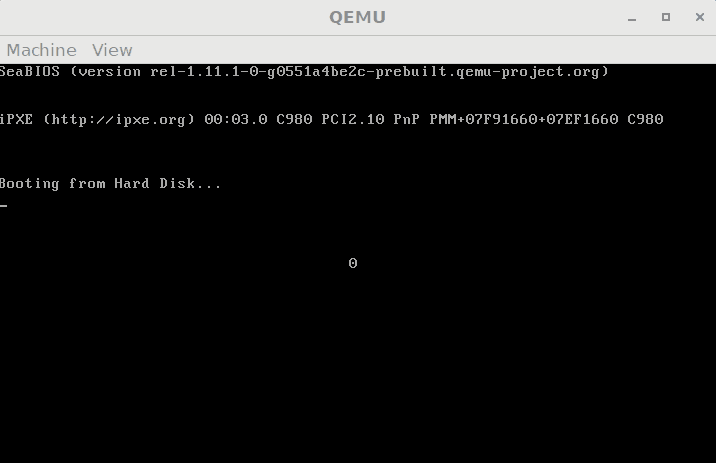

# 8254 数字跳跃实验

实验内容：

文本模式下在屏幕中央显示一个数字，数值从 0-9 跳跃，每秒 1 次。



思路：

8254 的 `OUT0` 与 8259 的 `IRQ0` 连接，因此，控制 8254 的 `CNT0` 产生每秒 1 次的脉冲信号，就相当于每秒产生 1 次 `IRQ0` 中断，BIOS 初始化时，`IRQ0` 对应 `INT8`，在中断向量表的地址是 8&lt;&lt;2=0x20，自定义该中断向量的中断服务程序即可。

实际上由于数值大小的限制，8254 的 `CNT0` 并不能产生每秒 1 次的脉冲信号，但是可以产生每秒 20 次的脉冲信号，然后在程序中设置一个计数器进行分频即可。

```text
    Screen_center equ ((12*80+39)<<1)

[org    0x7c00]

start:
    ; 设置初始值
    mov    ax,0xb800                     ; 文字模式的显存地址
    mov    es,ax
    mov    byte [es:Screen_center],'0'

    ; 设置中断向量
    cli                                    ; 关中断
    xor    ax,ax
    mov    es,ax
    mov    bx,0x20                        ; 中断向量号 0x20
    mov    word [es:bx],new_int_0x20      ; 自定义的中断处理程序的偏移地址
    mov    [es:bx+2],cs                   ; 段地址
    sti                                    ; 开中断

    mov    al,0b_00_11_011_0       ; 计数器 0，先低后高，方式 3，二进制计数
    out    0x43,al                 ; 写入控制寄存器
    mov    ax,59659                ; 设定计数初值
    out    0x40,al                 ; 写入 CNT0 端口
    mov    al,ah
    out    0x40,al

fin:
    hlt
    jmp    fin

; 自定义的中断处理程序
new_int_0x20:
        push    ax
        push    es

        cmp    byte [count],19
        jne    .new_int_0x20.count_noteq_19   ; 计数到 19 则改为 0，然后变化屏幕上的数字
        mov    byte [count],0

        mov    ax,0xb800                      ; 文字模式的显存地址
        mov    es,ax
        cmp    byte [es:Screen_center],'9'
        je    .new_int_0x20.al_equ_9
        inc    byte [es:Screen_center]         ; 屏幕数字不为 '9' 则加一
        jmp    .new_int_0x20.fin

    .new_int_0x20.al_equ_9:
        mov    byte [es:Screen_center],'0'     ; 为 '9' 则改为 '0'
        jmp    .new_int_0x20.fin

    .new_int_0x20.count_noteq_19:             ; 计数未到 19 则加一
        inc    byte [count]

    .new_int_0x20.fin:
        ; EOI
        mov    al,0x20
        out    0xa0,al
        out    0x20,al

        pop    es
        pop    ax
        iret

; 计数器，用于分频，范围 0-19，19 -> 0 时变化数字
count:
    db    0

signature:
    %if    $-$$>510
        %fatal    "stage1 code exceed 512 bytes."
    %endif

    times    510-($-$$) \
        db    0
    db    0x55,0xaa
```

> Overall, life would have been better if IBM had originally programmed the timer to interrupt after 59659 hardware ticks. This would have produced an interrupt 20 times per second, which would have been more convenient for everyone, with very little change in performance. \(Isn’t 20/20 hindsight wonderful?\)
>
> _Jim Lyon_'s review on [https://blogs.msdn.microsoft.com/oldnewthing/20041202-00/?p=37153](https://blogs.msdn.microsoft.com/oldnewthing/20041202-00/?p=37153), December 2, 2004 at 9:02 am.

参考资料：

* [https://wiki.osdev.org/Interrupt](https://wiki.osdev.org/Interrupt)

